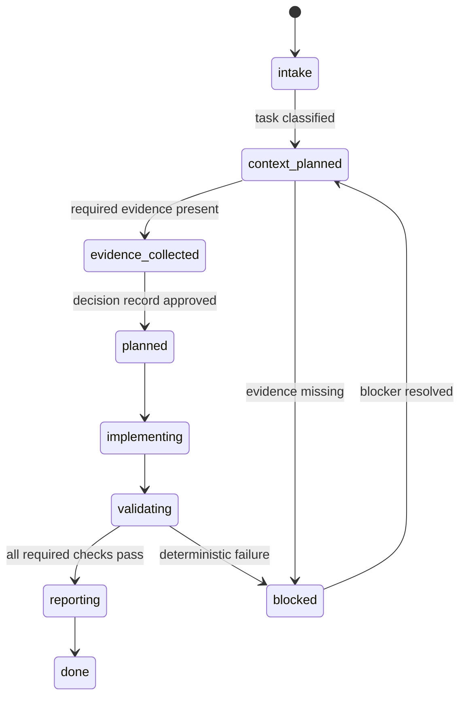

# Task state machine

```mermaid
stateDiagram-v2
    [*] --> intake
    intake --> context_planned: task classified
    context_planned --> evidence_collected: required evidence present
    context_planned --> blocked: evidence missing
    evidence_collected --> planned: decision record approved
    planned --> implementing
    implementing --> validating
    validating --> reporting: all required checks pass
    validating --> blocked: deterministic failure
    reporting --> done
    blocked --> context_planned: blocker resolved
```

## Blocking transitions
- Missing schema evidence.
- Ambiguous permissions/security mode.
- Unsafe request.
